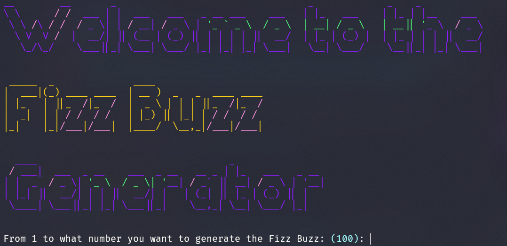

# FizzBuzz Generator


                   
<div align="center">


</div>
FizzBuzz Generator is a console program made in Python where you can specified the number (for example from 1 to 100) to resolve the FizzBuzz problem.


## [Execute in your editor](#Execute-in-your-editor)

---

**Python 3.8 required**

### Option 1

Use the package manager [pip](https://pypi.org/project/pip/) to install all the requirements:

```bash
pip install -r requirements.txt
```

Then to execute the aplication:

```bash
python main.py
```

### Option 2


Use the package manager [pipenv](https://pipenv.pypa.io/en/latest/) to install all the requirements:
```bash
pipenv install
pipenv shell
```


Then to execute the aplication:
```bash
python main.py
```


<!-- ## [Usage](#Usage)

---

To use the program just execute the .exe file


Your can also, use the following command to run the program in every platform:

```bash
dotnet run
``` -->
<!-- 
### [OS](#OS)

---

The program was tested only in Windows 10, if you want to try on another Windows or Operative System, let me know.
Thanks.

Pull requests are welcome. For major changes, please open an issue first to discuss what you would like to change.

Please make sure to update tests as appropriate. -->

### [Acknowledgements](#Acknowledgements)

---

-   [Rich](https://github.com/willmcgugan/rich) Rich is a Python library for rich text and beautiful formatting in the terminal..
-   [Art](https://github.com/sepandhaghighi/art) ASCII Art library for python

### [License](#license)

Closures is provided under the [MIT License](https://github.com/vhesener/Closures/blob/master/LICENSE).

```text
MIT License
Copyright (c) 2021 Pértile Franco Giuliano
Permission is hereby granted, free of charge, to any person obtaining a copy
of this software and associated documentation files (the "Software"), to deal
in the Software without restriction, including without limitation the rights
to use, copy, modify, merge, publish, distribute, sublicense, and/or sell
copies of the Software, and to permit persons to whom the Software is
furnished to do so, subject to the following conditions:
The above copyright notice and this permission notice shall be included in all
copies or substantial portions of the Software.
THE SOFTWARE IS PROVIDED "AS IS", WITHOUT WARRANTY OF ANY KIND, EXPRESS OR
IMPLIED, INCLUDING BUT NOT LIMITED TO THE WARRANTIES OF MERCHANTABILITY,
FITNESS FOR A PARTICULAR PURPOSE AND NONINFRINGEMENT. IN NO EVENT SHALL THE
AUTHORS OR COPYRIGHT HOLDERS BE LIABLE FOR ANY CLAIM, DAMAGES OR OTHER
LIABILITY, WHETHER IN AN ACTION OF CONTRACT, TORT OR OTHERWISE, ARISING FROM,
OUT OF OR IN CONNECTION WITH THE SOFTWARE OR THE USE OR OTHER DEALINGS IN THE
SOFTWARE.
```


[MIT](https://choosealicense.com/licenses/mit/)
